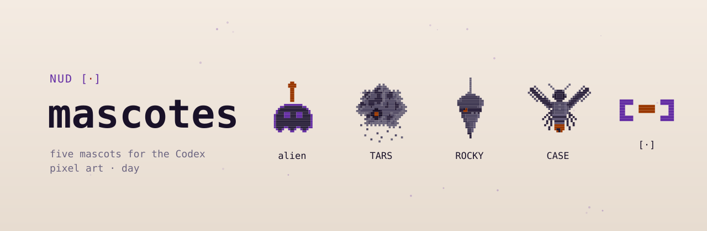

<a href="README.pt-BR.md">🇧🇷 Português</a>

# mascotes

The NUD by Whatevertr mascots, ready to install in Codex (OpenAI) as a *pet*: the **alien**, **TARS**, **ROCKY**, **CASE** and the **living marker** `[·]`. Pixel art, night state.

<picture>
  <source media="(prefers-color-scheme: dark)" srcset="assets/banner-night.svg">
  
</picture>

## Install in Codex

1. Download this repository (**Code → Download ZIP**) and unzip it.
2. In Codex: **Settings → Pets → Create pet**, and point to the folder of the mascot you want (each folder inside `pets/` is one mascot: `pet.json` + `spritesheet.webp`).
3. If you prefer to do it by hand: copy the folders from `pets/` into `C:\Users\<your user>\.codex\pets\` (Windows) or `~/.codex/pets/` (Mac and Linux), then reopen Codex.

`Alt+Win+P` shows and hides the pet on screen.

## The five

| Folder | Who it is |
|---|---|
| `pets/nud-alien-noite/` | the alien, the brand's mascot |
| `pets/nud-tars-noite/` | TARS, the Thinker |
| `pets/nud-rocky-noite/` | ROCKY, the Manager |
| `pets/nud-case-noite/` | CASE, the Worker |
| `pets/nud-marcador-vivo-noite/` | the living marker `[·]` |

TARS, ROCKY and CASE are the three functions of the [Constellation Method](https://github.com/whatevertr/constellation-method): think, conduct and execute.

License: [CC BY-NC-ND 4.0](https://creativecommons.org/licenses/by-nc-nd/4.0/) (you may download and share with credit; you may not modify or use commercially).
