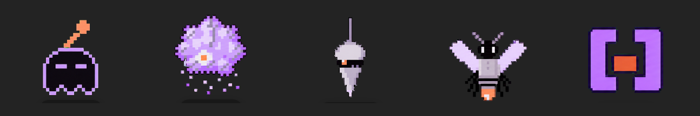

# mascotes

Os mascotes da NUD by Whatevertr, prontos para instalar no Codex (OpenAI) como *mascote*: o **alien**, **TARS**, **ROCKY**, **CASE** e o **marcador vivo** `[·]`. Pixel art, estado noite.

## Instalar no Codex

1. Baixe este repositório (**Code → Download ZIP**) e descompacte.
2. No Codex: **Configurações → Mascotes → Criar mascote**, e aponte para a pasta do mascote que você quer (cada pasta dentro de `pets/` é um mascote: `pet.json` + `spritesheet.webp`).
3. Se preferir fazer à mão: copie as pastas de `pets/` para `C:\Users\<seu usuário>\.codex\pets\` (Windows) ou `~/.codex/pets/` (Mac e Linux) e reabra o Codex.

`Alt+Win+P` mostra e esconde o mascote na tela.

## Os cinco

| Pasta | Quem é |
|---|---|
| `pets/nud-alien-noite/` | o alien, mascote da marca |
| `pets/nud-tars-noite/` | TARS, a Pensadora |
| `pets/nud-rocky-noite/` | ROCKY, a Gerente |
| `pets/nud-case-noite/` | CASE, a Trabalhadora |
| `pets/nud-marcador-vivo-noite/` | o marcador vivo `[·]` |

TARS, ROCKY e CASE são as três funções do [Método Constelação](https://github.com/whatevertr/constellation-method): pensar, conduzir e executar.

Licença: [CC BY-NC-ND 4.0](https://creativecommons.org/licenses/by-nc-nd/4.0/deed.pt-br) (pode baixar e compartilhar com crédito; não pode modificar nem usar comercialmente). Thainá Ramos (Nud by Whatevertr).
